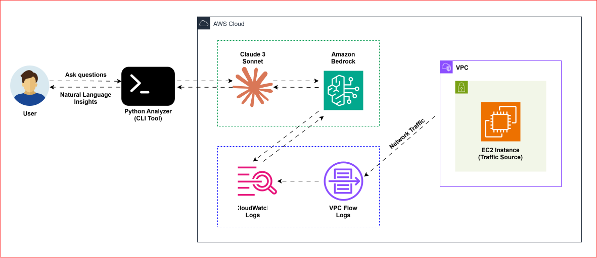

# 🧑‍💻Amazon Bedrock Powered VPC Flow Logs Analyzer
[](https://aws.amazon.com/bedrock/)
[](https://www.python.org/downloads/)

## Architecture


AWS **VPC Flow Logs** provide detailed information about IP traffic going to and from the network interfaces in the VPC, but analyzing them typically requires writing complex queries using tools like Amazon Athena, CloudWatch Logs Insights, or custom scripts. This creates a barrier for quick investigation, especially during troubleshooting or security analysis, where we must translate high-level questions into query syntax. 

VPC Flow Logs are critical source of information for network monitoring and security analysis. They can help us diagnose overlay restrictive or permissive security group and NACL rules. We can also monitor the traffic that is reaching the instance, understand traffic patterns and identify anomalies.However, manually analyzing these logs can be a time consuming task.

Through this project we will try to bridge the gap by enabling generative AI to analyze the VPC Flow Logs using **natural language**. By combining direct access to raw Flow Log records with **Amazon Bedrock**, the analyzer allows users to ask meaningful questions in plain English (e.g., “Which IP is sending the most traffic?” or “Are there any rejected connections?”) and receive answers grounded in actual log data.

In this project, we will use Amazon Bedrock, which is a fully managed service that offers a choice of high performing foundational models to understand the natural language queries and generate the appropriate code and queries to retrieve the information from the VPC flow logs. We can ask questions about VPC Flow Logs in plain English. 
This entire application is deployed using a single Python script.

Rather than replacing traditional query tools, this solution accelerates understanding, reduces cognitive load, and improves investigation speed, making VPC Flow Log analysis more accessible and interactive.

## Features of this project
* Validates the existence of VPC based on the provided VPC ID
* Checks if the VPC Flow Logs are present or not.
  If not present, it can give recommendations on how we can enable Flow Logs.
* We can retrieve and analyze the detailed flow log data and we can customize our prompts.
 - Provides natural language queries using AWS Bedrock
 - Gives access to actual Flow Log records
 - Specific answers with actual IP addresses, ports and protocols
 - Can specify logs needed within the custom time range

## Prerequisites for this project
1. Configure AWS CLI with appropriate permissions.
   The user with the AWS credentials should have the following permissions enabled.
   
   ```json
       {
          "Version":"2012-10-17",             
          "Statement": [
              {
                  "Effect": "Allow",
                  "Action": [
                      "ec2:DescribeVpcs",
                      "ec2:DescribeFlowLogs",
                      "logs:FilterLogEvents",
                      "bedrock:InvokeModel"
                  ],
                  "Resource": "*"
              }
          ]
       }
   ```

2. Python 3.10+
3. Access to AWS Bedrock
4. VPC flow Logs enabled
5. Access to an AI model
   - We will be using Claude 3 Sonnet

## Project Set-Up
1. Install dependencies:

   ```
   pip install -r requirements.txt
   ```
## Usage
Run the Python Analyzer:
   ```
   python vpc_flow_analyzer.py
   ```

The CLI tool will:
1. Ask us to enter the VPC ID
2. Then it checks if the VPC exists in the specified region
3. Verifies whether the VPC Flow Logs are enabled or not
4. Asks us to specify the time range, where we need to enter the time range to analyze the Flow Logs
5. Then it retrieves the Flow Log data for the specified time range
6. We can questions(prompts) in natural language

## Example Prompts
We can ask the questions to the analyzer, which has access to the detailed VPC Flow Log data.
Following are some example questions:

* **Questions for IP Address Analysis:**
  - "Are there any connections originating from 106.163.0.159?"
  - "List the source IP addresses"
  - "List the destination IP addresses"
  - "Which IP has the most traffic?"
 
* **Questions for Traffic Analysis:**
  - "Which interface has the most traffic?"
  - "What is the largest data transfer?"

* **Questions for Port and Protocol Analysis:**
  - "Are there any SSH connections?" 
  - "List all the TCP Connections"
  - "Show me all the protocols being used"
  - "What destination ports are being accessed?"

* **Questions for Security Analysis:**
  - "Show me all the rejected connections"
  - "Show me all the failed connection attempts"
  - "Are there any suspicious activities?"


