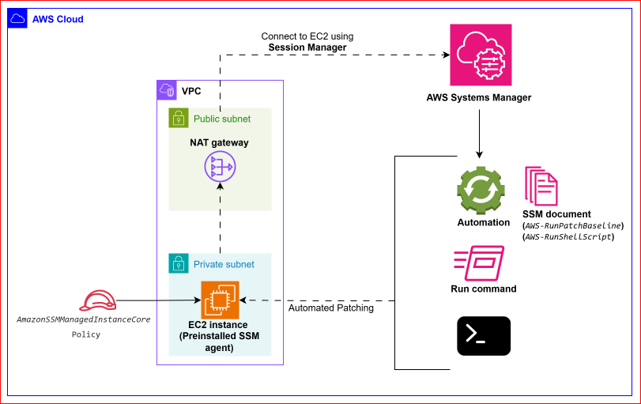

# Automated EC2 Patch Management Using AWS Systems Manager (SSM)
## Architecture


### Architecture Overview
- EC2 instances are launched in a private subnet without public IPs
- A NAT Gateway in a public subnet enables outbound HTTPS access
- AWS Systems Manager is used for:
  - Secure shell access (Session Manager)
  - Patch management
  - Remote command execution
  - Inventory collection
- No SSH or inbound ports are required

## Project Overview
In this project we'll mainly focus on how we can use **Amazon Systems Manager** to perform software updates.

It is important to keep the software on the instance up to date. 
Packages in a Linux distribution or any OS are updated frequently to fix bugs, add features, and protect against security exploits.
When we first launch an instance, we might see a message asking us to update software packages for security purposes.

Let us automate the process of patching by using **AWS Systems Manager documents** to run commands on EC2 instances.


## Step 1: Create an IAM Role for EC2 instance

Create an IAM role to grant the EC2 instances permission to interact with AWS Systems Manager.
The EC2 instance needs permission to access AWS Systems Manager so that the SSM Agent running on the instance can authenticate itself and call AWS Systems Manager APIs on behalf of that instance.

    IAM Console > Roles > Create Role > Trusted entity type: AWS service > Use case: EC2 > Add `AmazonSSMManagedInstanceCore` managed policy


## Step 2: Create EC2 instances
### 1. VPC Configuration: 
1. Create a VPC with a public subnet (for NAT gateway) and a private subnet (for EC2 instance).
Make sure the internet gateway is created together.

2. Before creating a NAT gateway, create an **Elastic IP address**. EIP provides a static public IP address for the NAT gateway, so that the instances in private subnet can reach the internet. 
An Elastic IP provides a static public IP address for the NAT Gateway, which allows instances in the private subnet to access the internet.
AWS requires an Elastic IP for a public NAT Gateway to ensure stable outbound connectivity and reliable return traffic.

    Once the EIP is created, proceed with creating the Nat gateway. 
Choose the public subnet to place it in, select the **Connectivity type** as **Public**. 
Associate the EIP created earlier.

### 2. Create EC2 instances: 
* Create two EC2 instances, one is going to be using Amazon Linux and other will use Ubuntu.
Make sure the AMI that's being used has AWS Systems Manager Agent (SSM Agent) preinstalled, which can be confirmed through [this](https://docs.aws.amazon.com/systems-manager/latest/userguide/ami-preinstalled-agent.html) document.

  **SSM Agent** is Amazon software that runs on an EC2 instance and enables AWS Systems Manager features such as Session Manager, Run Command, Patch Manager, and Inventory.
* The SSM Agent requires outbound TCP port 443 because it communicates with AWS Systems Manager endpoints over HTTPS using agent-initiated, encrypted API calls. No inbound connections to the EC2 instance are required.


    ```
    # Instance 1
    Name: ubuntu-instance
    AMI: Ubuntu Server
    Architecture: 64-bit (x86)
    Key pair: Proceed without a key pair, since we are going to use Systems Manager
    Network settings: Use VPC created in the previous step
    Subnet: Private subnet
    Auto-assign public IP: disable
    Security group: Create security group
    IAM Role: Assign the IAM Role created in the previous step


    # Instance 2
    Name: Amazon-linux-instance
    AMI: Amazon Linux AMI
    Architecture: 64-bit (x86)
    Key pair: Proceed without a key pair, since we are going to use Systems Manager
    Network settings: Use VPC created in the previous step
    Subnet: Private subnet
    Auto-assign public IP: disable
    Security group: Select the existing security group(The one we created for the ubuntu-instance)
    IAM Role: Assign the IAM Role
    ```


Both EC2 instances will include the Systems Manager agent installed on those instances.
This is because the AMIs that we used include the Systems Manager agent.
To verify that, go to Systems Manager > Fleet Manager > Managed Nodes, will show both of the running EC2 instances.

If we click on any instance, we can get to see additional information like SSM Agent version, file system overview of the EC2 instance etc., which gives us internal operating system visibility. 
This allows us to interact with the file system without having to connect to the instance.

## Step 3: Performing software updates on the EC2 instances
Connect to the `ubuntu-instance` instance using **Session Manager**, which will be connected to a shell on the instance.
**Sessions Manager** is a part of **Systems Manager** and we can connect to it because the instance has access to the Systems Manager endpoint & we've given it permissions using the instance role. 

Run the following command to know if any packages requires updates. 
Let us skip the update process because we're going to perform the update using Systems Manager.

```sh
sudo apt update && sudo apt upgrade
```

### Patching using Patch Manager
1. Go to the Systems Manager Console > Patch Manager > Start with an overview > Compliance reporting > Patch now.

2. Basic configuration:
   - Patching operation - Scan and install
   - Reboot option - Reboot if needed
   - Instances to patch - Patch all instances
   - Patching log storage - Do not store logs
3. Click on 'Patch now', which will initiate Systems Manager to patch all of the available nodes (instances) which it has access to.
Once the screen shows 'operation was successful', we can verify if the software has been updated by connecting to the EC2 instance using Sessions Manager and running the same command mentioned above.
There will be a lot less packages to update compared to last time.
We might see a number of other updates, which are generally optional updates which the Systems Manager won't have performed updates on.
But this can be configured if we want to go into more detail & configure more advanced options of the Patch Manager functionality of Systems Manager.

4. Go back to Systems Manager and click on the `Association ID` for this patch update. Go to 'Versions' tab and look under the 'Documents name', which shows a configuration document that was run against EC2 instances. 
**SSM Documents** can be lists of directives or configuration items which can be applied to things that are managed by Systems Manager.
   - Copy the name of the document (AWS-RunPatchBaseline), on the left panel > shared resources > Documents > In the search box, paste in the name of the documents that we just copied > Open the document > Content.
   - **SSM documents** are JSON or YAML files that contain instructions on what to run on a managed node.
   Amazon provides a lot of different managed documents for things like patching an instance or running custom shell scripts, setting tags on instances, configuring port forwarding and much more.
   `AWS-RunPatchBaseline` document checks for operating system type and runs applicable commands to update the operating system. 
   This document can be used for Windows, Linux or macOS managed nodes & it can help perform software updates on each of these different types of OS.
5. Go back to Systems Manager and click on the `Execution ID`, which shows the individual execution targets which has been run on.
   - Choose any instance and click on `output`, which should show each of different main execution steps for this document. 
   That is, one for Windows, one for Linux and one for macOS.
   Obviously the document will be used for one particular OS.

## Step 4: Run commands
Let us use Systems Manager to run commands on EC2 instance.
Under Node management select 'Run Command' > Run Command > Search and select `AWS-RunShellScript`.
   1. Under 'Command parameters' enter the following lines:
        ```sh
        # Creates a file named hello_from_systems_manager on Linux instance
        sudo touch /hello_from_systems_manager

        # Adds a user within the Linux OS called 'pranav'
        sudo useradd -c "Pranav Swaroop" pranav

        ```
   2. Under 'Target selection' > Choose instances manually 
   3. Under 'Instances' > Select both instances
        - This is going to run this command on both the instances
   4. Under 'Output options', uncheck 'Enable an S3 bucket' 
   5. Click 'Run', which runs the command document on the EC2 instances.
   6. **Verification:** Connect to any instance using Session Manager and run the following command, after which we should be able to see the file that we've just created using Systems Manager.
       ```sh
       ls -l /

       # shows the list of users created on the Linux operating system
       sudo tail /etc/passwd

       ```

## Step 5: Enable inventory on the instances

Systems Manager > Node Management > **Inventory** > click on 'Click here to enable inventory on all instances' > Click on one of the instances > Inventory.
* We can see additional information like applications installed, detailed overview of networking that's been gathered from the EC2 instance. 

## References
1. [Find AMIs with the SSM Agent preinstalled](https://docs.aws.amazon.com/systems-manager/latest/userguide/ami-preinstalled-agent.html)
2. [Update instance software on your AL2 instance](https://docs.aws.amazon.com/linux/al2/ug/install-updates.html)
3. [AWS Systems Manager Patch Manager](https://docs.aws.amazon.com/systems-manager/latest/userguide/patch-manager.html)
4. [AWS Systems Manager Inventory](https://docs.aws.amazon.com/systems-manager/latest/userguide/systems-manager-inventory.html)
