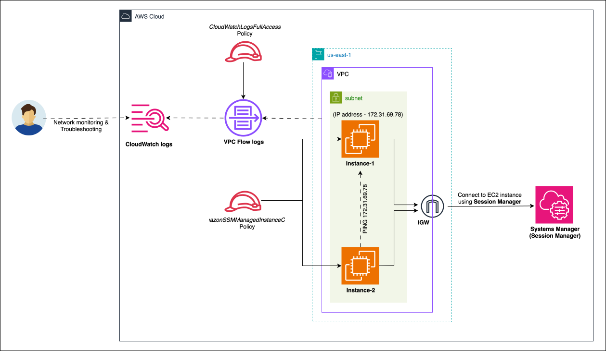

# 🔍📋 Diagnosing network issues with VPC Flow logs
In this project we'll be creating two EC2 instances in `us-east-1` region and diagnose a connectivity issue between them using VPC Flow logs.
We get to learn about how we can configure VPC flow logs, point those flow logs at CloudWatch logs, how we can configure appropriate security by diagnosing the issues and identify why the traffic is being impacted either via security group or Network ACLs.

[](https://docs.aws.amazon.com/vpc/latest/userguide/flow-logs.html)
[](https://docs.aws.amazon.com/systems-manager/latest/userguide/session-manager.html)

## Architecure


## Step 1: Create IAM Roles

### 1. IAM Role for EC2 instances to connect to Session Manager and interact with Systems Manager

Create an IAM Role for the EC2 instances and attach the `AmazonSSMManagedInstanceCore` managed policy.

### 2. IAM Role for VPC Flow logs to interact with the CloudWatch logs

Select the **Trusted entity type** as `Custom trust policy` and paste the following policy so that this role can be assumed by AWS VPC-flow-logs.

```json
{
  "Version": "2012-10-17",
  "Statement": [
    {
      "Effect": "Allow",
      "Principal": {
        "Service": "vpc-flow-logs.amazonaws.com"
      },
      "Action": "sts:AssumeRole"
    }
  ]
}
```

We also need to allow permissions to the Flow-logs-service in order to interact with the CloudWatch logs.
Add `CloudWatchLogsFullAccess` policy and create the Role.

## Step 2: Create two EC2 instances
1. Choose the AMI as `Amazon Linux 2023 AMI` and make sure these instances have `SSM Agent` pre-installed on them through [this](https://docs.aws.amazon.com/systems-manager/latest/userguide/ami-preinstalled-agent.html) documentation.
2. For **Key pair(login)**, select `Proceed without a key pair` since we are going to connect to the instance using **Session Manager**.
3. Under **Network Settings**, select the default VPC. 
Select **Create security group** and note down the name of the SG.
Uncheck, Allow SSH traffic from anywhere.
4. Under **Advanced details**, select the IAM Role that was created for the EC2 instance earlier.
5. Under **Number of instances**, change it from 1 to 2 and click on **Launch instance**.

## Step 3: 🔌 Testing Connectivity between the two instances
1. Select both the instances using **Session Manager**.
Make sure that the instance ID is different on each of the tabs.
2. On both the instances, run the following command, which is a short form for `ip address`.
It shows all the IP addresses assigned to all the network interfaces.
The IP on the interface `eth0` is literrally the same IP address that is shown in the EC2 console.


    ```sh
    ip a
    ```
3. Try to ping one instance from the other.
Pick either of the two instance as a **Source**, which is the instance where we'll try to initiate a connection to the **destination** IP, that is the other instance. Run the following command, and place the IP address of the destination EC2 instance in place of `<ip address>`.

    ```sh
    # Runs '3' pings from the instance we are running this on to the instance ip address that we specify and it's going to wait '1' seconds for each of these pings to respond. 
    ping <ip address> -c 3 -W 1
    ```

   When we run the above command, it outputs something like:

    ```yaml
    PING 172.31.69.78 (172.31.69.78) 56(84) bytes of data.

    --- 172.31.69.78 ping statistics ---
    3 packets transmitted, 0 received, 100% packet loss, time 2045ms
    ```

   As we can see, we are not able to ping the other instance. This indicates a potential connectivity issue between this instance and other instance. We need to remember that the traffic has to flow from this instance to the other instance and then back again.


   To make sure that this is not an AWS specific problem, run the following command where we'll use an internet IP address.

    ```yaml
    # 8.8.8.8 is the IP address of Google Public DNS
    ping 8.8.8.8 -c 3 -W 1
    ```
   This shows that we can ping an interner based IP, but we are not able to ping our other EC2 instance. 
And we're going to use VPC flow logs to help us diagnose this issue.

## Step 4: Diagnose the issue
### Create CloudWatch log group and VPC flow logs
**1. Create a CloudWatch log group for VPC flow logs**

Create a log group called `VPC-flow-logs-demo`.

**2. Create VPC-flow logs**

Select the VPC that we are using for this project, go to the **Flow logs** tab and create a flow log. 
Leave the 'Filter' to `All` selected. 
Choose the 'Maximum aggregation interval' as `1 minute`.
Since we want to send these logs to CloudWatch logs, choose the 'Destination' as `Send to CloudWatch Logs`, and in the 'Destination log group', select the `VPC-flow-logs-demo` that we just created. 
We also need to provide flow logs permission to write into the CloudWatch log group and we'll do that using the IAM role that we created in the step 1. 
Leave other settings to default and click on 'Create Flow logs'.

### 🚀 Begin the diagnosis

1. Go back to the Session Manager tab and ping the destination IP address from the source instance as described in the step 3.
Once we run the command, the activity will be recorded inside the flow logs.

   Make a note of the instance ID where we are running the ping from.
Go back to the EC2 instance console, select the particular instance from the instance ID that we just noted down.
Under 'Networking', look for the `ENI ID` , that is the **Elastic Network interface ID** and note it down.

   Go to the CloudWatch logs, go into the `VPC-flow-logs-demo` log group.
Open the 'Log streams' that matches the ENI ID we just noted down.
We can see the entries that has been recorded by the flow logs.
The log streams uses a specific AWS format as shown in the following example:

    ```yaml
    2 123456789010 eni-1235b8ca123456789 204.93.207.13 172.31.69.78 123 50402 17 1 76 1679806575 1679806630 ACCEPT OK
    ```
    * `2` is the VPC Flow log version
    * `123456789010` is the AWS account ID
    * `eni-1235b8ca123456789` is the ENI ID of the instance
    * `204.93.207.13` is the source IP
    * `172.31.69.78` is the destination IP 
    * `123` is the source port
    * `50402` is the destination port
    * `17` is the protocol (17 is UDP, 1 is ICMP and 6 is TCP)
    * `1` is the number of packets transferred in this particular flow
    * `76` is the number of bytes transferred in this flow
    * `ACCEPT` shows that the traffic was accepted and not blocked by an ACL or a security group
    * `OK` shows the log status, signifying that the flow was logged successfully


2. Go back to Session Manager and ping the `8.8.8.8` address. 
Go back to CloudWatch logs and search for `8.8.8.8` in the logs.
We can see the following log being recorded.
Which shows the outbound flow of packets from our instance to `8.8.8.8` and we can see `ACCEPT OK` and then the line above is the return flow.


    ```yaml
    # Return flow from 8.8.8.8 back to the EC2 instance. '1' is the protocol for ICMP
    2 123456789010 eni-1235b8ca123456789 8.8.8.8 172.31.69.78 0 0 1 3 252 1679806870 1679806930 ACCEPT OK
    ```
    ```
    2 123456789010 eni-1235b8ca123456789 172.31.69.78 8.8.8.8 0 0 1 3 252 1679806870 1679806930 ACCEPT OK
    ```

3. Go the the Session Manager console and copy the IP address of the instance that we were pinging (not the IP of the instance that we were pinging from).
Search the logs with the IP address that we just copied.
The log shows that the flow of data from the source instance to the destination instance was accepted with `ACCEPT OK`, but there's no response packets.


4. 🕵🔧 **Troubleshooting:**

   **This indicates that the packets were blocked or lost elsewhere.
This tells us the security group on this ENI isn't the problem, because it's not blocking any data.**

   Let's go back to the EC2 console and select the destination instance, go to the 'networking' tab and get the ENI ID.
Ckeck the VPC flow logs for the destination ENI.
In the `VPC-flow-logs-demo` log group, and open the log stream with ENI ID of the destination instance.

   Get the IP address of the source instance and enter the IP in the search bar.
We can notice that the ping from source IP is being rejected by the destination IP with `REJECT OK` status.
**This shows that there's an error in the security group attached to the destination instance.**

   Go to the EC2 console and select the destination EC2 instance's security group. 
   If you notice, we haven't added any **inbound rules** to the security group. 
   **Since it doesn't have any inbound rule, it's not allowing the ping from the source instance to enter this interface.
   We need to fix this problem by adding the inbound rule of type `All ICMP - IPv4` from source `Anywhere - IPv4` `0.0.0.0/0`.**

   Now this means that the SG that's associated with the ENI of the destination instance will allow any IPv4 ICMP traffic to enter that interface and it's also going to allow any traffic out.

   We can test this by going back to the source instance and re-running the ping to the destination EC2 instance and now we can see that it works.

5. **Blocking inbound rule at the Network ACL level:**

   Select the source instance, select the subnet associated with the instance.
Go to the NACL of the subnet, and open the outbound rules.
We can see two rules: The **default implicit deny** at the bottom and **explicit allow** at the top which allows all outbound traffic. 

   Let's edit these outbound rules and add a **rule with greater priority** than the **default explicit allow**.

   > Note: The Outbound rules are processed in the order of rule number, where a rule with lower number takes higher priority. 

   * Use a lower rule number so that it will be processed before the **Allow all traffic** rule.


    ```
    Rule number     Type              Protocol      Port range     Destination     All/Deny
    100             All traffic       All           All            0.0.0.0/0       Allow
    1               All ICMP - IPv4   ICMP(1)       All            0.0.0.0/0       Deny
    *               All traffic       All           All            0.0.0.0/0       Deny
    ```
    
    Go back to the source instance and rerun the ping command.
We can notice that it still works because both of these instances are contained in the same subnet and the traffic doesn't cross the subnet boundary and isn't impacted by the network ACl.
However, if we try to ping `8.8.8.8`, this time the ping doesn't work & we don't get any response back.

   Go to the flow log group of the source EC2 instance and search for 8.8.8.8 in the log stream. 
We can notice that the ping from the source IP to the destination IP of 8.8.8.8 is being blocked with `REJECT OK` status.

   Analyzing the flow logs helps us identify where traffic is being impacted. 

## References
1. [Find AMIs with the SSM Agent preinstalled](https://docs.aws.amazon.com/systems-manager/latest/userguide/ami-preinstalled-agent.html)
2. [Google Public DNS IP addresses](https://developers.google.com/speed/public-dns/docs/using?_gl=1*1d9hqt*_up*MQ..*_ga*MTY3OTgzMDYyNS4xNzY5MDQ4MTMz*_ga_SM8HXJ53K2*czE3NjkwNDgxMzMkbzEkZzAkdDE3NjkwNDgxMzMkajYwJGwwJGgw)
3. [Flow log record examples](https://docs.aws.amazon.com/vpc/latest/userguide/flow-logs-records-examples.html)
4. [Protocol Numbers](https://www.iana.org/assignments/protocol-numbers/protocol-numbers.xhtml)
